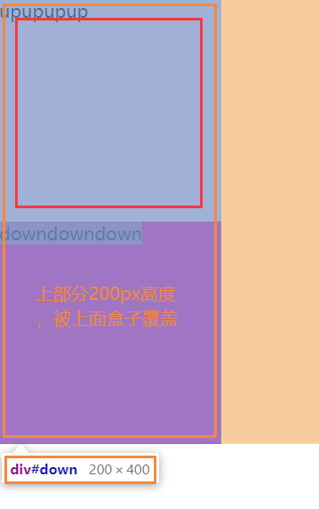
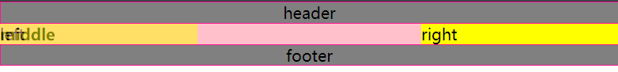
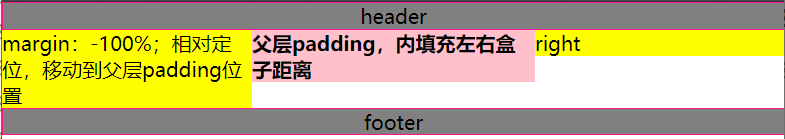
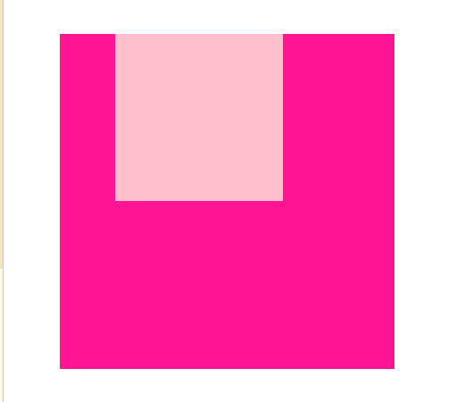
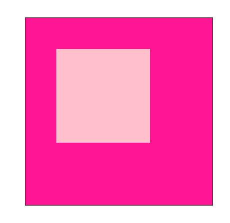
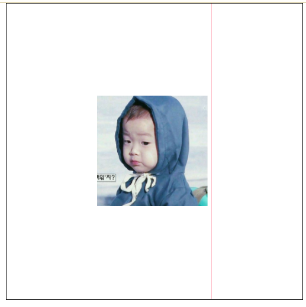

# CSS

## 一、布局和定位

### 1. 基本知识

#### 1.1. 包含块

1. 根元素包含块： 窗口视图大小
2. 其他元素包含块

#### 1.2. 默认值

1. width和height：auto
2. 定位后 ，left和top：auto
3. margin和padding：0
4. 百分比：相对于包含块（父盒子）的width

#### 1.3. 浮动

1. 脱离文档流 （浮动中，分两层：盒子层和文本层）。
2. 层级提高一个盒子层。

### 2. 三列布局（圣杯，双飞翼）

#### 2.1. 总结

- 浮动脱离文档流，层级提升半层（盒子层，文本层，提升盒子层。定位提升整个层级）

- 清除浮动

  ```css
  .clearfix{
      /*css hack兼容IE6,7 开启haslayout */
  	*zoom: 1;
  }
  .clearfix:after{
      content: "";
      display: block;
      clear: both;
  }
  ```

> 条件：
>
> 1. 两边固定  当中自适应
> 2. 当中列要完整显示
> 3. 当中列要优先显示（middle放在left和right之前）

#### 2.2. 圣杯布局

1. 中间盒子设置   `width：100%` ，设置body最小宽度  `min-width: 600px;`
2. 三个盒子全部浮动，设置左右盒子位置 `margin-left=-100%,margin-left:-right.width` 
3. 父层设置`padding:0 right.width`，相对定位，把左右盒子移动各自宽度，定位后
4. 父层需清除浮动（浮动脱离文档流，相对定位提升层级，后面盒子会挤上来）

#### 2.2.1 等高布局

1. (伪等高，自适应)：在圣杯布局中添加自适应高度（内容高度）

   `padding:10000px;margin-bottom:-10000px`

#### 3. 双飞翼布局

1. 中间盒子设置   `width：100%` ，设置body最小宽度  `min-width: 600px;`
2. 三个盒子全部浮动，设置左右盒子位置 `margin-left=-100%,margin-left:-right.width` 
3. 中间盒子添加子级盒子，子级盒子设置`padding:0 right.width`

### 3. 解决IE6中fixed失效问题

#### 3.1. 总结和知识点

- fixed相对于当前显示视口定位，IE6中失效。
- absolute相对于浏览器打开时视口（默认包含块）定位。
- 滚动条是文档（html标签父层）中滚动条，滚动时当前视口更改。
- `<html>、<body>`添加  `overflow`属性，如果只有一个会作用于文档(html父层)，两个标签都设置该属性时，才会作用于body。

#### 3.2. 解决失效思路

1. 去除文档滚动条，不更改当前显示视口（显示初始视口，即默认包含块）
2. 给body添加滚动条
3. fixed更改为absolute。这样可以保证body滚动并且当前视口不变，初始视口，即包含块不变，absolute定位不变，从而实现fixed效果。

#### 3.3. 解决失效步骤

1. 清除文档滚动条

   ```html
   <style>
       html,body{
           height:100%
           overflow:hidden;
       }
   </style>
   ```

2. 给body设置滚动条

   ```html
   <style>
       /*html,body{
           height:100%
           overflow:hidden;
       }*/
       html{
           height:100%;
           overflow:hidden;
       }
       body{
           height:100%;
     	/* 设置为自动，内容超过视口高度自动添加滚动条 overflow:scroll*/      
           overflow:auto; 
       }
   </style>
   ```

3. fixed更改为absolute

#### 3.4. 解决失效用途

- 移动端设置fixed固定布局

### 4. 黏连布局（sticky footer）

#### 4.1.  黏连布局思路

1. 两个div盒子，wrap区域和footer区域

2. wrap内部创建一个main盒子，main更改padding（三列布局）空出footer位置。footer通过`margin-top:-footer.width`置于wrap底部。

3. 更改wrap的`height:100%  --> min-height:100%`可以显示全部内容。

   ```html
   <style type="text/css">
       *{
           margin: 0;
           padding: 0;
       }
       html,body{
           height: 100%;
       }
       #wrap{
           min-height: 100%;
           background: pink;
           text-align: center;
           overflow: hidden;
       }
       #wrap .main{
           padding-bottom:50px ;
       }
       #footer{
           height: 50px;
           line-height: 50px;
           background: deeppink;
           text-align: center;
           margin-top: -50px;
       }
   </style>
   <body>
       <div id="wrap" >
           <div class="main">
               main <br />
               main <br />
           </div>
       </div>
       <div id="footer">
           footer
       </div>
   </body>
   ```

   

### 5. BFC

#### 5.1. BFC解释

> BFC（block formatting context）：块级格式化上下文。
> 简单来说它就是一种会影响元素与元素之间的位置、间距的属性。

#### 5.2. 如何创建BFC

1. 根元素`<html>`
2. 浮动`float:left,right 但不能为none`
3. 溢出方式`overflow:hidden，auto，scroll 但不能为visible`
4. 显示方式`display:table-cell，table-caption，inline-block, flex, inline-flex`
5. 定位 `position:flex,absoulte`

#### 5.3. BFC规则

1. 内部盒子从垂直方向，一个接一个放置。（常见情况）
2. 内部盒子垂直方向的距离由margin决定，属于同一个BFC的两个相邻盒子的margin会发生重叠，与方向无关
   1. 不相邻解决
      - 同级盒子：添加br或者div让两个盒子不相邻，需设置高度，br为21px。此方法不建议使用；
      - 父子盒子：父盒子添加边框。
   2. 不处于同一个BFC：添加父层盒子，设置父层为BFC
3. BFC的区域不会与float的元素区域叠加。
4. BFC就是页面上的一个隔离的独立容器，容器里面的子元素不会影响到外面的元素，反之亦然。
5. 计算BFC的高度时，浮动子元素也参与计算。（清除浮动 haslayout）

#### 5.4. 例子

1. 处理margin叠加问题
2. 两列布局 
   1. 一个浮动，另一个添加`overflow:hidden`使用BFC的区域不会与float的元素区域叠加。
   2. 左右都使用浮动，父盒子清除浮动
3. 清除浮动
   1. 可以清除浮动，计算BFC高度，浮动元素不会撑开父元素的高度，我们可以让父元素触发BFC,即：使用overflow:hidden;
   2. 设置伪元素和zoom兼容

### 6. css hack

#### 6.1. 符号

#### 6.2. HTML注释

#### 6.3. js统一解决办法

```html
<script type="text/javascript">
			console.log(isIE(8));
	
			//js中的作用域都是函数作用域
			function isIE(version){
				var b = document.createElement("b");
				b.innerHTML="<!--[if IE "+version+"]><i>aaaa</i><![endif]-->";
				//b是一个元素，但是没载入DOM中
				return   b.getElementsByTagName("i").length == 1 ;
			}

		//伪数组:  具有length属性的js对象
//		console.log(document.body.getElementsByTagName("i").length);
	</script>
```

### 7. 文本

#### 7.1. 字体

1. 单位
   1. em 相对于父级 ，1em 一倍的默认font-size
   2. % 相对于父级的font-size的百分
2. font-family 字体类型，字体组类型，
3. font-style 倾斜 normal、italic、oblique
4. font简写：font-style font-weight font-size/line-height font-family (注意：以font-size为中心，位置有限制。)

#### 7.2. 行高

1. 单行文本垂直居中：line-height 设置与文本包含块height相同

2. 溢出文字显示省略号

   ```css
   display:block;
   white-space:nowrap;/* 是否自动换行 */
   overflow:hidden;
   text-overflow:ellipsis; /*省略号 */
   ```

   

3. 图片垂直居中

   1. vertical-agin：用来指定行内元素（inline）或表格单元格（table-cell）元素的垂直对齐方式。

      - 注意 `vertical-align` 只对行内元素（img，input）、表格单元格元素生效：不能用它垂直对齐块级元素

   2. 应用图片垂直居中 

      ```html
      <style type="text/css">
          *{
              margin: 0;
              padding: 0;
          }
          #wrap{
              height: 400px;
              width: 400px;
              border: 1px solid ;
              margin: 0 auto;
              text-align: center;
          }
          #wrap:after{
              content: "";
              display: inline-block;
              height: 100%;
              width: 1px; /*设置为0，更改行框*/
              background: pink;
              vertical-align: middle;
          }
          #wrap img{
              vertical-align: middle;
          }
      </style>
      <body>
          <div id="wrap">
              
          </div>
      </body>
      ```

      

## 二、选择器

### 1.  基本概念

1. 名称

   CSS(Casading Style Sheet)层叠样式表

2. 组成

   样式表->多条规则->多个选择器+声明块->多条声明->多条css属性+属性值组成的键值对

3. 浏览器编译顺序

   从右往左读取


### 2.  选择器

#### 2.1. 基本选择器

1. id选择器
2. 类选择器
3. 元素选择器
4. 通配符选择器

#### 2.2. 选择器扩展

1. 后代选择器 `.class1 .class2 #id{}`
2. 子元素选择器（直接后代选择器） `.class1 > .son_class1`  **只有儿子辈有效**
3. 相邻兄弟选择器 `.class > .class1 + .class2` 只有class2生效  必须在class1**之后且紧跟的一个兄弟元素**
4. 通用兄弟选择器  `.class ~ .class2`  **之后的所有兄弟生效（不需要紧跟）**
5. 选择器分组  `.class1,.class`

#### 2.3. 属性选择器

1. 存在和值属性选择器(css2)
   1. `[attr]`：该选择器选择包含 attr 属性的所有元素，不论 attr 的值为何。	
   2. `[attr=val]`：该选择器仅选择 attr 属性被赋值为 val 的所有元素。			
   3. `[attr~=val]`：表示带有以 attr 命名的属性的元素，并且该属性是一个以空格作为分隔的值列表，其中至少一个值为val。 `<div name="at_val val">12314</div>`
2. 子串值属性选择器(css3)
   1. `[attr|=val]` : 选择attr属性的值以val-开头（包括val）的元素		
   2. `[attr^=val]` : 选择attr属性的值以val开头（包括val）的元素。		
   3. `[attr$=val]` : 选择attr属性的值以val结尾（包括val）的元素。
   4. `[attr*=val]` : 选择attr属性的值中包含字符串val的元素。

#### 2.4. 伪类选择器

1. 链接伪类(顺序：l->v->h->a)

   1. `a:link` : 未访问的链接
   2. `a:visited` : 已访问过的链接（根据URI判断）
      1. 允许属性有限制 `color,background-color,border-color`
   3. `div:target` uri与id一样时匹配div。
      1. 选项卡

2. 动态伪类

   1. `:hover`
   2. `:active`

3. 表单伪类

   1. `:enabled`	匹配可编辑的表单				

   2. `:disable`	匹配被禁用的表单			

   3. `:checked`	匹配被选中的表单

      1. 模拟单选框

         ```html
         <style>
             /*隐藏自带按钮left:-50px; overflow:hidden*/
             label{ 
                 float:left;
                 margin:0 5px;
                 overflow:hidden; 
                 position:relative;
             }
             label input{
                 position:absolute;
                 left:-50px;
                 top:-50px;
             }
             span{
                 float:left;
                 width:50px;
                 height:50px;
                 border:3px solid #000;
             }
             input:checked~span {
                 background:red;
             }
         </style>
         </head>
         <body>
             <label>
                 <input type="radio" name="tab" />
                 <span></span>
             </label>
             <label>
                 <input type="radio" name="tab" />
                 <span></span>
             </label>
             <label>
                 <input type="radio" name="tab" />
                 <span></span>
             </label>
         </body>
         ```

         ​				

   4. `:focus`		匹配获焦的表单

4. 结构性伪类

   1. 注意点：
      1. `ele:nth-child(index)`只要是子类就开始计数，匹配ele标签
      2. `ele:nth-of-type(index)`以元素为中心，相同ele元素开始计数，匹配ele。
      3. 可以为变量，只能为n，2n+1，odd，even等等
   2. `:nth-child(index)`系列						
      1. `:first-child`
      2. `:last-child`
      3. `:nth-last-child(index)`
      4. `:only-child`	(相对于`:first-child:last-child` 或者`:nth-child(1):nth-last-child(1)`)
   3. `:nth-of-type(index)`系列		
      1. `:first-of-type`
      2. `:last-of-type`			
      3. `:nth-last-type(index)`				
      4. `:only-of-type`	(相对于`:first-of-type:last-of-type`或者 `:nth-of-type(1):nth-last-of-type(1)`)
   4. `:not()`
   5. `:empty`

#### 2.5. 伪元素选择器 （在文档中产生结构，不在DOM中）

1. `::afert`
2. `::before`
3. `::firstLetter`首字母
4. `::firstLine`首行
5. `::selection` 被选中样式

### 3. 优先级

#### 3.1. 比较顺序

1. 来源-->重要声明--> 普通声明-->先后顺序
2. 比较依据特殊性等级。

#### 3.2. 来源

1. 三种来源
   1. 创作人员
   2. 读者
   3. 用户代理
2. 来源权重
   1. 读者的重要声明（少见，需要设置浏览器。Chrome和Firefox未提供读者概更改接口）   
   2. 创作人员的重要声明
   3. 创作人员的正常声明
   4. 读者的正常声明
   5. 用户代理的声明

#### 3.3. 特殊性等级

1. 重要声明（`!important`）
2. 继承
   - 继承没有特殊性，甚至连0特殊性都没有，0特殊性（通配符选择器）要比无特殊性来的强
3. 选择器特殊性（**不进位，写多个选择器名称可叠加（之间没空格）**）
   1. 内联声明 `<a style="xxx:xxx;"></a>` `1,0,0,0`
   2. id选择器 `#idname{}` `0,1,0,0`
   3. 类，属性，伪类选择器 `.classname{} [input]{} :link{} ` `0,0,1,0`
   4. 元素，伪元素选择器 `div{} ::after{}`   `0,0,0,1`
   5. 通配符选择器  `*{}`  `0,0,0,0`


## 三、自定义字体

### 1. 自定义字体(@font-face)

#### 1.1.  用途

- 网页开发者为其网页指定在线字体（需要请求服务器下载字体文件）

#### 1.2. 使用步骤

1. style中使用 `@font-face`声明字体

   ```html
   <style>
       @font-face{
           font-family:"fontname";
           src: url(font/BAUHS93.TTF);
       }
       #test{
           font: 50px "Damu";
       }
   </style>
   <body>
       <div id="test">
           圆滚滚 QHF
       </div>
   </body>
   ```

   

### 2. 字体图标

## 四、新增UI方案

### 1. 文本新增样式

#### 1.1. opacity透明度

#### 1.2. 新增颜色模式rgba()

#### 1.3. 文字阴影

1. 阴影效果**可叠加**，使用逗号分隔

 	2. `text-shadow: color offset-x offset-y blur-radius`
 	3. `filter:blur(10px)` css模糊函数

#### 1.4. 文本描边

- **只有webkit中支持**，-webkit-text-stroke

#### 1.5. 文字排版

1. direction：控制文字方向
2. 文本溢出显示省略号

### 2. 盒模型新增样式

#### 2.1. 盒模型阴影

1. `box-shadow:inset offset-x offset-y blur-radius spread-radius color`  属性：内阴影 横向偏移 纵向偏移 模糊 阴影扩大缩小（可取负值） 颜色

#### 2.2. 倒影

- **只有webkit中支持**，-webkit-box-reflect  设置元素的倒影（文字描边，背景镂空）
- 值：倒影的方向：`above, below, right, left`；倒影的距离；渐变

#### 2.4. resize

1. resize CSS 属性允许你控制一个元素的可调整大小性。（**一定要配合overflow：auto使用）**
2. 值：
   - none：   元素不能被用户缩放。 
   - both：   允许用户在水平和垂直方向上调整元素的大小。
   - horizontal：   允许用户在水平方向上调整元素的大小。
   - vertical：   允许用户在垂直方向上调整元素的大小。

#### 2.5. box-sizing

1. box-sizing 属性用于更改用于计算元素宽度和高度的默认的 CSS 盒子模型。(混杂模式和严格模式 `!DOCTYPE`)

2. 值：

   - content-box：默认值，标准盒子模型。 width 与 height 只包括内容的宽和高， 不包括边框（border），内边距（padding），外边距（margin）。

   -  border-box： width 和 height 属性包括内容，内边距和边框，但不包括外边距。这是当文档处于 Quirks模式 时Internet Explorer使用的盒模型。

     ```
     这里的维度计算为：
     width = border + padding + 内容的  width，
     height = border + padding + 内容的 height。
     ```

### 3. 新增UI样式

#### 3.1. 圆角  `border-radius`

1. 值：最大为盒子宽度一半，即一个圆，大于宽度一半仍是一个圆
   1. 固定的px值定义圆形半径或椭圆的半长轴，半短轴。不能用负值     
   2. 使用百分数定义圆形半径或椭圆的半长轴，半短轴。水平半轴相对于盒模型的宽度；垂直半轴相对于盒模型的高度。不能用负值
   3. 椭圆：`border-radius:40px/60px  60px` 半轴/(半轴 + 半轴)；使用百分比为宽高百分比
2. 移动端建议使用**px作为单位**。
3. 例子：风车，对话框

#### 3.2. 边框图片

1.  `border-image-source: none` 属性定义使用一张图片来代替边框样式

2. `border-image-slice: 100%` 分割为9个区域
   - 四个角，四边以及中心区域
   - 值为顺时针，第一个值为上面横向线段，右边纵向，下方横向，左边纵向
   - 值得百分比参照于image本身！！
3. `border-image-width: 1`
4.  `border-image-outset: none`定义边框图像可超出边框盒的大小
5.  `border-image-repeat: stretch`  定义图片如何填充边框`stretch （拉伸）  repeat，round（平铺）`

#### 3.3. 背景

1. css2中`background-color`
2. `background-image:url(img/border-image.png),url(img/tg.png)`设置一个或多个背景图像，先指定的图像会在之后指定的图像**上面**进行绘制。
3. `background-repeat`
4. `background-position`指定背景位置的初始位置

   - 百分比：参照尺寸为背景图片定位区域的大小减去背景图片的大小  

   - 第一个值：元素在水平方向的位移
   - 第二个值：元素在垂直方向的位移 
5. css2中`background-attachment`决定背景是在视口中固定的还是随包含它的区块滚动的。(不建议使用)

   -    fixed此关键字表示背景相对于视口固定。即使一个元素拥有滚动机制，背景也不会随着元素的内容滚动 。
- scroll 此关键字表示背景相对于元素本身固定， 而不是随着它的内容滚动
6. css3中`background-origin`设置背景的渲染的起始位置
7. `background-clip`设置背景裁剪位置 ，以文字为裁剪位置，**只有webkit中支持** `-webkit-background-clip: text;`
8. `background-size` 设置背景图片大小

#### 3.4. 渐变

1. 线性渐变
   - 默认从上到下发生渐变，可以更改角度`linear-gradient(deg,rgba() start-x,rgba() end-x)`
   - 重复渐变`repeating-linear-gradient(60deg,red 0,blue 30%);`
2. 径向渐变

## 五、过渡&变形

### 1. 过渡

#### 1.1. 基本知识

1. `transition`简写属性

   - 默认值：`transition-delay: 0s,transition-duration: 0s,transition-property: all,transition-timing-function: ease`
   - 默认值顺序：过渡时间  过渡样式  过渡形式  延迟时间 [，过渡时间  过渡样式  过渡形式  延迟时间]。第一个可以解析为时间的值会被赋值给`transition-duration`  例如：`transition:2s width,3s height`

2. `transition-property` 属性：指定过渡的属性，默认值为all

3. `transition-duration`属性：指定过渡所需的时间

   - 需要加单位，0秒也要加，如果指定时间列表中其中一个时间没有单位，过渡则会失效。
   - 如果指定的时长个数小于属性个，那么时长列表会重复数。如果时长列表更长，那么该列表会被裁减。

4. `transition-timing-function`：调整过渡变化速度

   - 常用属性：
     - `ease`：（加速然后减速）默认值；
     - `linear`：（匀速）
     - `ease-in`：(加速)，
     - `ease-out`：（减速）
     - `ease-in-out`：（加速然后减速）与`ease`有区别，贝塞尔曲线不同
   - `cubic-bezier`： 贝塞尔曲线
   - `step-start`：等同于`steps(1,start)`开始一步到位；`step-end`：等同于`steps(1,end)`到过渡时间时一步到位；`steps(步数,start|end)`

#### 1.2.  注意点

1. css中过渡属性前后顺序

   ```css
   #test{
       width: 100px;
       height: 100px;
       background: pink;
       text-align: center;
       position: absolute;
       left: 0;
       right: 0;
       bottom: 0;
       top: 0;
       margin: auto;
   
       transition-property: width;
       transition-duration: 2s;
       transition-timing-function: linear;
   }
   /* 鼠标移动到body上，过渡时，变换高度，离开时变换宽度 */
   body:hover #test{
       transition-property: height;
       width: 200px;
       height: 200px;
   }
   ```

   

2. transition在元素首次渲染还没有结束的情况下是不会被触发的

   - JavaScript中直接更改高度无效，首次渲染未结束

     ```js
     var test = document.querySelector("#test");
     test.style.width="300px";
     ```

   - 解决办法：`window.onload=function(){ ...... }` 或者`setTimeout(function(){......},time)`

   - 首次渲染

     ```js
     window.onload=function(){
         //此处div#test为首次渲染
         var test = document.createElement("div");
         test.id="test";
         document.documentElement.appendChild(test);
         setTimeout(function(){
             test.style.width="300px";
         },2000)
     }
     ```

3. 检测过渡是否完成事件  `transitionend`

### 2. 变换 

#### 2.1.  


